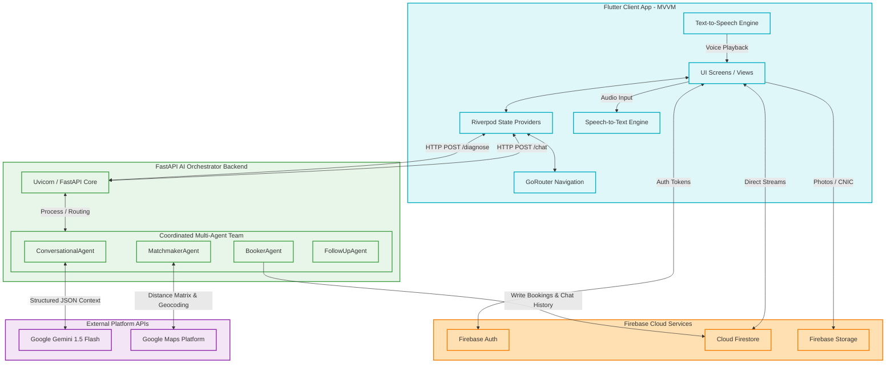
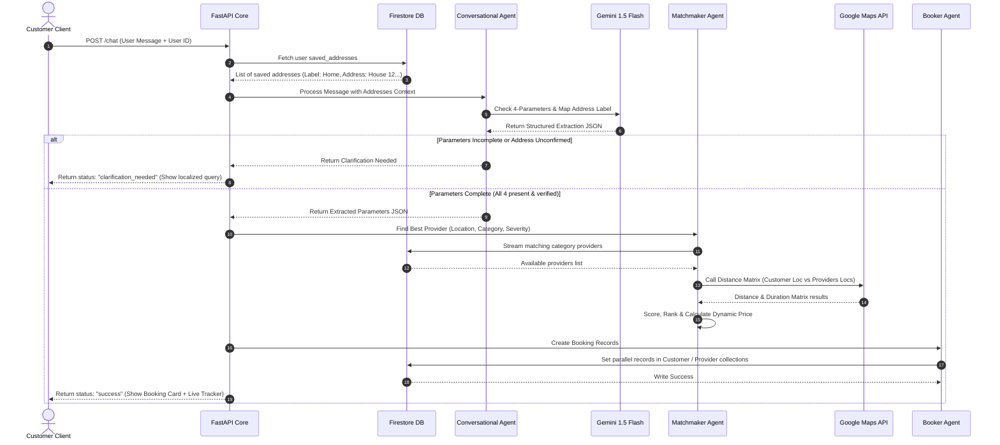

# HAAZIR (حاضر) — Premium Multilingual AI-Driven On-Demand Home Services Platform
## Technical Specification & Product Architecture Manual

> [!NOTE]
> **HAAZIR** (meaning *"Present"* or *"At Your Service"* in Urdu) is a state-of-the-art, on-demand marketplace connecting household customers in Pakistan with certified local service providers (plumbers, electricians, AC technicians, cleaners, painters). This document provides an exhaustive architectural blueprint, technical API integrations, operational boundaries, and a detailed walkthrough of the product's interface.

---

## 1. Executive Summary & The "Trilingual Core"

The informal services industry in Pakistan comprises millions of skilled blue-collar workers and household customers. However, existing software solutions fail due to a critical barrier: **Language and Accessibility**. Technicians and standard users often communicate in spoken Urdu, Roman Urdu (Urdu written phonetically in Latin characters), or formal Urdu script, while modern software defaults strictly to English.

HAAZIR bridges this digital divide through its **Trilingual Package**, a deeply integrated, localization-first design supporting three primary linguistic profiles across all UI headers, text boxes, inline error validations, and AI processing agents:

| Language Package | Targeted Demographic | Script | Example in Application |
| :--- | :--- | :--- | :--- |
| **English** | Corporate users, bilingual urban centers, administrative operations. | Latin | *"Mobile Number is required."* |
| **Roman Urdu** | Large-scale casual demographic, standard smartphone typists. | Latin | *"number tou enter kro"* |
| **Urdu Script** | Native speakers, non-English literate blue-collar service providers. | Arabic (Nastaliq) | *"موبائل نمبر درج کریں۔"* |

This trilingual architecture ensures that regardless of the user's literacy or typing preferences, the application remains fully accessible, establishing a highly inclusive household service marketplace in Pakistan.

---

## 2. Comprehensive System Architecture

HAAZIR is built on a hybrid cloud, decoupled architecture combining a high-performance **Flutter Frontend** (Client), a scalable **Firebase Cloud Layer** (Data & Auth), and an intelligent **Python FastAPI Multi-Agent Orchestrator** (AI Engine).



### A. The Flutter Frontend (Client)
- **MVVM Pattern**: Isolates UI elements from underlying business logic. State Providers monitor network requests, and Views listen and rebuild dynamically.
- **Riverpod State Management**: Feeds localized configurations and database records through reactive providers (`localeProvider`, `chatProvider`, `authProvider`, `profileProvider`).
- **Native Integrations**:
  - `speech_to_text`: Converts voice commands from Pakistani speech patterns into text transcripts, supporting localized Urdu script translation.
  - `flutter_tts`: Reads chat replies back to the user in a natural Urdu (`ur-PK`) or English (`en-US`) voice synthesizer.
  - `google_maps_flutter`: Renders interactive maps, custom pins, and real-time polylines representing provider drive routes.

### B. The Firebase Cloud Layer
- **Firebase Authentication**: Secures customer and provider authentication states. Supports Google Sign-In and local phone security PIN configurations.
- **Cloud Firestore**: Holds application state across top-level collections:
  - `Users`: Document per user storing names, phone numbers, and an array of `saved_addresses` (containing custom labels like *Home, Work, Abbu ka Ghar*).
    - Sub-collection `Bookings`: Encapsulates a history of private customer orders.
    - Sub-collection `ChatLogs`: Houses full conversational threads with the AI Concierge.
  - `ProviderProfiles`: Documents representing registered, verified service technicians containing category, rating, location coordinates, and base fees.
  - `ProviderJobs`: Direct portal for active service contractors.
    - Sub-collection `Jobs`: Synchronized in real-time with customer booking requests.
- **Firebase Storage**: Hosts high-resolution profile pictures and CNIC document images for provider verification.

### C. The FastAPI Multi-Agent Orchestrator Backend
The Python backend processes heavy cognitive tasks through a highly structured Multi-Agent framework:
1. **Conversational Agent (`ConversationalAgent`)**:
   - Parses incoming text transcripts using **Gemini 1.5 Flash**.
   - Enforces a strict **4-Parameter Booking Rule**: A booking is only finalized when it successfully extracts **Service Category**, **Exact Location (House & Street numbers)**, **Arrival Time**, and **Repair Detail**.
   - Inspects the user's Firestore `saved_addresses`. If the user refers to a place label (e.g. *"meray ghar"* or *"office"*), it translates the label into English, checks for a semantic match, and triggers a specialized, bilingual **Address Confirmation Protocol** (e.g., *"Is this the address? 'House 5, Street 10, F-8'..."*).
2. **Matchmaker Agent (`MatchmakerAgent`)**:
   - Executes upon 4-parameter completion.
   - Searches the active `ProviderProfiles` matching the requested trade.
   - Calls the **Google Maps Distance Matrix API** to calculate driving distance and duration from the provider's coordinates to the customer's physical location.
   - Scores and ranks matching providers using a rating-to-distance algorithm:
     $$\text{Score} = (\text{Rating} \times 10,000) - \text{Distance (meters)}$$
   - Computes dynamic ticket pricing using distance-based fuel rates and repair severity multipliers:
     $$\text{Total Price} = (\text{Base Labor} + (\text{Distance (km)} \times \text{Fuel Rate})) \times \text{Severity Multiplier}$$
   - *Note: Fuel Rate is indexed to Pakistan market pricing (e.g., Rs. 410/12 per km).*
3. **Booker Agent (`BookerAgent`)**:
   - Generates a UUID for the confirmed transaction.
   - Writes identical transaction records in parallel to the Customer's `Bookings` sub-collection and the Provider's `Jobs` sub-collection, guaranteeing transactional consistency.
   - Archives chat histories to `ChatLogs` to save context.
4. **Follow-Up Agent (`FollowUpAgent`)**:
   - Simulates post-booking push notification triggers to remind the customer of provider arrival states.

---

## 3. Core API and Service Integration

The orchestrator backend exposes two highly robust POST endpoints to the mobile client:

### A. AI Concierge Booking Pipeline (`/chat`)
- **Endpoint**: `/chat`
- **Method**: `POST`
- **Request Body**:
```json
{
  "message": "mujhe ghar k liye plumber chahiye abhi, nal tapak raha hai",
  "user_id": "cust_3819207",
  "history": []
}
```
- **Execution Pipeline**:


---

### B. Provider Voice-to-Text Diagnosis Pipeline (`/diagnose`)
- **Endpoint**: `/diagnose`
- **Method**: `POST`
- **Request Body**:
```json
{
  "transcription": "bhai ac ka compressor phat gaya tha aur capacitor change karna parega",
  "base_fare": 500,
  "service_type": "ac technician"
}
```
- **Behavior**:
  - The provider records their vocal summary of the issue directly inside their dashboard using the device mic (utilizing Flutter `speech_to_text`).
  - This transcription is sent to the `/diagnose` endpoint.
  - The backend queries Gemini 1.5 Flash to automatically detect issue severity (Level 1 to 5), recommend specific required hardware parts, estimate realistic Pakistani market parts prices, add standard category-based labor fees, and compile a bilingual english and urdu diagnostic card.
- **Sample Success Response**:
```json
{
  "status": "success",
  "severity": 4,
  "parts_recommended": [
    "Panasonic AC Capacitor 45uF",
    "Copper wire joint"
  ],
  "parts_cost": 1850,
  "additional_labor": 1200,
  "updated_fare": 3550,
  "summary_en": "AI Diagnosed: Major AC capacitor failure. Recommended part: Panasonic 45uF Capacitor. Severity: Level 4.",
  "summary_ur": "تشخیص: اے سی کپیسیٹر کی خرابی۔ تجویز کردہ پرزہ: پیناسونک کپیسیٹر۔ شدت: لیول 4۔"
}
```

---

## 4. The "Antigravity Development Log" — Key Engineering Achievements

HAAZIR was engineered in partnership with **Antigravity**, the agentic AI developer. Over the course of the project, Antigravity successfully resolved critical design challenges:

### A. Decoupled Firestore Database Syncing
- **Challenge**: Initially, customer bookings and provider jobs were written to single flat collections. This caused severe write bottlenecks, missing real-time sync listeners, and security risks as providers could potentially poll other customer histories.
- **Solution**: Antigravity designed and implemented a sub-collection schema (`Users/{cust_id}/Bookings/{book_id}`) synchronized in transaction blocks. Parallel pipelines update provider directories independently, maintaining immediate state updates without leaking private client profiles.

### B. Post-Frame Dialog Rendering Loop
- **Challenge**: Navigating back to screens (e.g., returning to Profile after saving edits) and immediately firing a success modal would trigger Flutter's famous error: `setState() or markNeedsBuild() called during build`.
- **Solution**: Antigravity engineered a global `DialogHelper` utility with a custom redirection query parameter handler. By capturing `?saved=true` and wrapping the popup trigger inside a post-frame callback:
  ```dart
  WidgetsBinding.instance.addPostFrameCallback((_) {
    DialogHelper.showSuccess(context, message: "Changes Saved!");
  });
  ```
  The app safely renders glassmorphic overlays immediately after transition layouts settle.

### C. Bulletproof Local Rules Fallback Engine
- **Challenge**: Heavy usage of Google Gemini during local code hacking could trigger API rate limits (`429 Too Many Requests`) or high-demand timeouts (`503 Service Unavailable`), resulting in failed simulation diagnostics or empty booking states.
- **Solution**: Antigravity built a secondary, regex-based localized rules engine directly into FastAPI (`backend/main.py`). If the Gemini SDK catches an exception, the backend instantly routes the request to local parsing rules mapping key terms (e.g., *"leak", "toti", "compressor", "wiring"*) to pre-calculated severities and price estimates, ensuring the app remains 100% active and responsive under any condition.

---

## 5. Technical Assumptions and Operational Limitations

To provide a transparent overview of the platform, the operational boundaries are explicitly defined:

### A. Geographic Center Lock
- **Assumption**: Active mapping services are bound to the Twin Cities region of Pakistan (**Islamabad** and **Rawalpindi**).
- **Limitation**: Map centering coordinates and geocoding fallbacks default to Islamabad center. Requests originating outside this zone (e.g., Lahore or Karachi) will center polyline pathing on Islamabad-Rawalpindi map markers for simulation consistency.

### B. Payment Ecosystem Boundaries
- **Assumption**: The application operates on Cash on Delivery (CoD).
- **Limitation**: While visual wallet screens (EasyPaisa, JazzCash, Debit Card options) are designed and render with high-fidelity aesthetics, their APIs run in mock validation mode. Actual payment exchanges remain physical.

### C. Live Route Path Simulation
- **Assumption**: Providers do not have to drive cars around the block during testing to demonstrate GPS mapping updates.
- **Limitation**: The client app simulates route movement mathematically. It fetches a route polyline between the provider and customer coordinates via Google Maps Directions API, then interpolates GPS coordinate steps sequentially on a timer, moving the provider icon on the map step-by-step to demonstrate active tracking.

### D. Verification Boundaries
- **Assumption**: Provider backgrounds and CNIC uploads undergo official state checking.
- **Limitation**: NADRA CNIC validation and criminal record checking are simulated internally. Documents uploaded via the camera are securely written to Firebase Storage, but approval is completed via mock database entries rather than real government API integrations.

---

## 6. Visual Product Walkthrough

Below is a structured walkthrough of the HAAZIR mobile client interfaces, showing the flow of booking a service and managing jobs.

````carousel
### Slide 1: Customer AI Concierge Chat (booking_chat.png)

The primary interface of HAAZIR is a clean, conversational panel. Users type or speak their request (Trilingual voice input via the mic icon). The AI concierge greets them, translates context on the fly, and parses out missing details.


- **Key UI Elements**: Trilingual greeting, speech-to-text mic toggle, dynamic support assistant hints.
- **Core Technology**: Gemini 1.5 Flash conversational engine, Speech-to-Text localized transcription.

<!-- slide -->

### Slide 2: Booking Summary & Assignment (booking_details.png)

Once the 4-parameters are compiled, the Matchmaker selects the top provider. The screen renders a premium summary card with the assigned technician (Asif Khan), their distance (9 min away), certification rating, and estimated cost calculated based on distance and fuel rates.


- **Key UI Elements**: Estimated fare (Rs. 729), certified safety badge, best-value tag, alternative nearby provider suggestions.
- **Core Technology**: Distance Matrix proximity calculation, dynamic severity-fuel multiplier pricing.

<!-- slide -->

### Slide 3: Live Map Tracking (live_tracking.png)

After booking confirmation, the customer can monitor the provider's physical approach. The screen displays the live location, detailed ETA (11 min), driving distance (4.3 km), and a dual Urdu/English text block indicating status.


- **Key UI Elements**: Live-drawn blue polyline path in Islamabad, status texts, call/message action buttons.
- **Core Technology**: Google Maps Flutter SDK, simulated GPS coordinate step interpolation.

<!-- slide -->

### Slide 4: Provider's Interactive Dashboard (provider_dashboard.png)

The gateway for technicians to manage their service business. It features a master toggle to change statuses to ONLINE, summary statistics (Today's Earnings, Jobs Done, Acceptance, Ratings), and a list of active and recent service assignments.


- **Key UI Elements**: Status toggle (ONLINE/OFFLINE), modern glassmorphic stat widgets, recent job ledger with color-coded completed/cancelled badges.
- **Core Technology**: Real-time Firestore streaming listeners, state sync.

<!-- slide -->

### Slide 5: Historical Job Ledger (job_history.png)

A comprehensive transaction registry for service contractors, allowing them to review their service records, earnings per job, and location details.


- **Key UI Elements**: Categorized job icons (AC, electric, plumbing), distinct color tags representing completion, clean chronological layout.
- **Core Technology**: Firestore database index querying.
````

---

## 7. Setup & Run Instructions (Quick Start)

### A. FastAPI Backend Orchestrator Setup
1. **Prepare Environment**: Navigate to `/backend`, create a virtual environment, and activate it:
   ```bash
   python -m venv venv
   .\venv\Scripts\activate  # Windows
   source venv/bin/activate # Mac/Linux
   ```
2. **Install Dependencies**:
   ```bash
   pip install fastapi uvicorn firebase-admin google-genai googlemaps python-dotenv
   ```
3. **Environment Configuration**: Create a `.env` file inside `/backend` with the following variables:
   ```env
   GEMINI_API_KEY="your_gemini_api_key_here"
   GOOGLE_MAPS_API_KEY="your_google_maps_key_here"
   ```
4. **Firebase SDK Key**: Place your `serviceAccountKey.json` from the Firebase Console in the backend root directory.
5. **Run Development Server**:
   ```bash
   uvicorn main:app --reload --host 0.0.0.0 --port 8000
   ```

### B. Flutter Client Application Setup
1. **Get Packages**: Run from the root workspace directory (`/haazir`):
   ```bash
   flutter pub get
   ```
2. **Review Assets**: Verify that `pubspec.yaml` contains all screen assets and localized icons.
3. **Deploy to Device**: Run on an attached Android/iOS device or simulator:
   ```bash
   flutter run --debug
   ```
