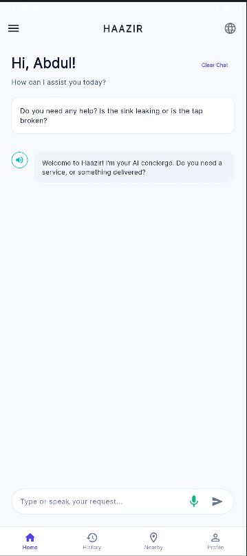
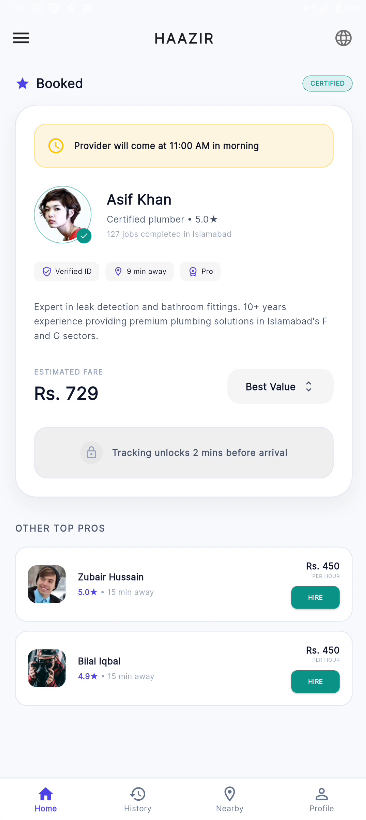
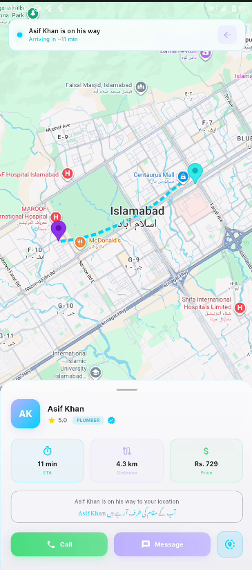
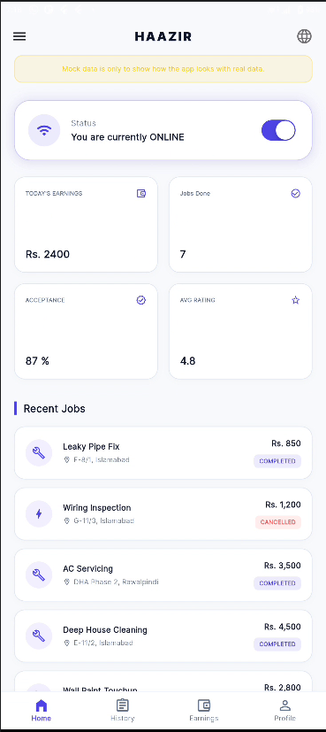
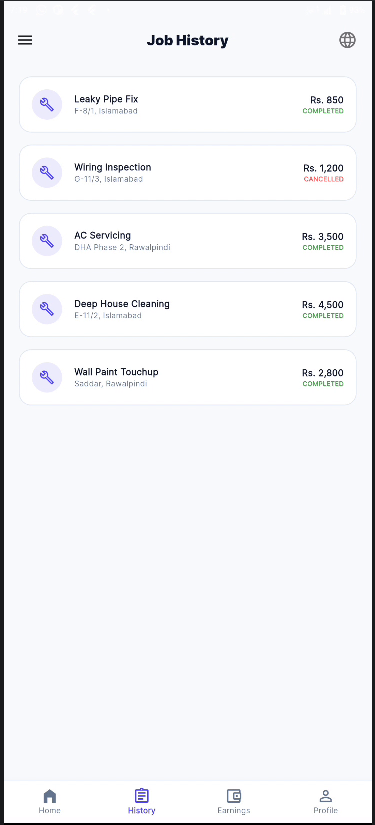
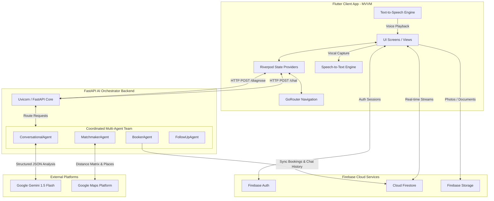
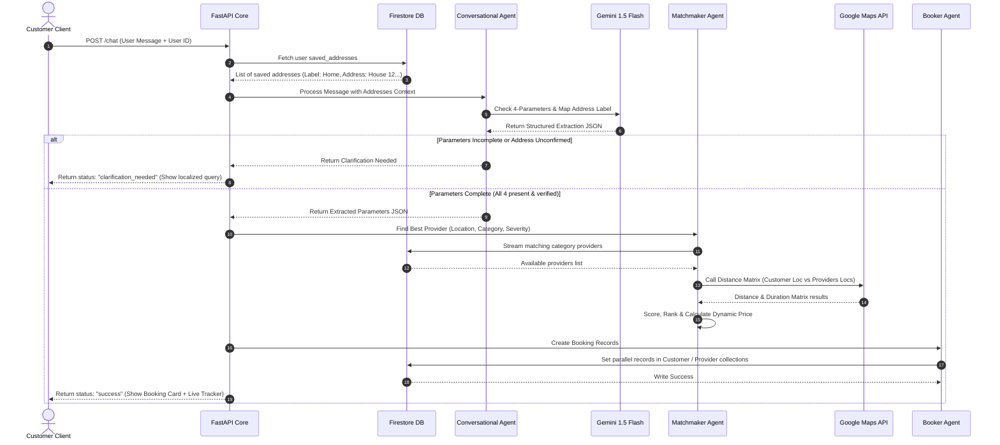

# HAAZIR (حاضر) — Premium Multilingual AI-Driven On-Demand Home Services Platform

HAAZIR (meaning *"Present"* or *"At Your Service"* in Urdu) is a state-of-the-art, on-demand home services marketplace connecting customers in Pakistan with certified, local service providers (plumbers, electricians, AC technicians, cleaners, painters). 

This is the **unified technical specification and project manual** compiled directly into the codebase repository for GitHub landing-page presentation.

---

## 📖 Table of Contents
1. [The Trilingual Core Package](#1-the-trilingual-core-package)
2. [Visual Product Walkthrough](#2-visual-product-walkthrough)
3. [System Architecture Specification](#3-system-architecture-specification)
4. [Core API & Service Catalog](#4-core-api--service-catalog)
5. [The "Antigravity" Agentic AI Dev Log](#5-the-antigravity-agentic-ai-dev-log)
6. [Technical Assumptions & Operational Limitations](#6-technical-assumptions--operational-limitations)
7. [Installation & Local Setup Guide](#7-installation--local-setup-guide)

---

## 1. The Trilingual Core Package

The informal home services industry in Pakistan is supported by millions of skilled blue-collar workers and casual customers. However, standard booking platforms consistently fail due to a major barrier: **Language and Digital Literacy**. Technicians and standard users communicate in spoken Urdu, Roman Urdu (Urdu written phonetically in Latin script), or Urdu Script, while modern software defaults strictly to English.

HAAZIR solves this accessibility crisis by delivering a **unified Trilingual Package**. Every label, text-field hint, success overlay, validation alert, error warning, and underlying AI prompt is localized natively into three linguistic profiles:

| Language Package | Targeted Demographic | Script | App Integration Example |
| :--- | :--- | :--- | :--- |
| **English** | Corporate managers, urban bilingual centers, administration. | Latin | *"Mobile Number is required."* |
| **Roman Urdu** | Casual demographic, high-volume smartphone texters. | Latin | *"number tou enter kro"* |
| **Urdu Script** | Primary blue-collar providers, native Urdu readers. | Arabic (Nastaliq) | *"موبائل نمبر درج کریں۔"* |

This trilingual wrapper breaks the accessibility barrier, enabling any citizen or local technician to navigate, communicate, and conduct business effortlessly.

---

## 2. Visual Product Walkthrough

Here is the end-to-end user experience of HAAZIR, tracking a service lifecycle from customer booking to provider completion.

### A. Customer: Conversational Booking Portal
The primary entry point is an intuitive, clean conversational screen. Users can type or speak in English, Urdu script, or Roman Urdu. The AI Concierge extracts their problem and clarifies missing details dynamically.

<p align="center">
  
</p>

* **Core Features**: Dual speech/text input toggle, dynamic localized placeholder guides, and a "Clear Chat" session button.
* **Technology**: Built-in `speech_to_text` transcription mapped directly to Gemini 1.5 Flash conversational agents.

---

### B. Customer: Verified Provider Summary Card
Once the AI Concierge gathers the details, the matching engine pairs the client with the optimal technician. The user is presented with an interactive summary card outlining estimated costs and professional bios.

<p align="center">
  
</p>

* **Core Features**: Estimated dynamic price card (Rs. 729), certified safety badge, 9-minute eta index, and custom provider reviews.
* **Technology**: Real-time Firestore document streaming, Google Maps distance matrix algorithms.

---

### C. Customer: Live Route Path Tracking
Upon checkout, the customer monitors their assigned technician's physical drive route in real-time.

<p align="center">
  
</p>

* **Core Features**: High-contrast blue driving polyline path in Islamabad, status updates in Roman Urdu/Urdu script, and direct call/message portals.
* **Technology**: `google_maps_flutter` SDK, coordinate step interpolation simulators.

---

### D. Provider: Service Contractor Dashboard
The dedicated portal for blue-collar contractors to manage their operations, toggle availabilities, track daily earnings, and accept active orders.

<p align="center">
  
</p>

* **Core Features**: One-tap ONLINE status toggle, glassmorphic overview stats (Today's Earnings Rs. 2400, Jobs Done: 7), and an interactive list of recent assignments with color-coded badges.
* **Technology**: Real-time reactive Firestore streams, state sync hooks.

---

### E. Provider: Historical Job Ledger
A clean historical ledger allowing providers to audit their past jobs, earnings per service, and completed locations.

<p align="center">
  
</p>

* **Core Features**: Service-category visual indicators (plumbing, electrical, AC repair), chronological job lists, and clear status flags.
* **Technology**: Decoupled Firestore collection index queries.

---

## 3. System Architecture Specification

HAAZIR is built on a decoupled, three-layer topology separating the **Flutter Client**, **Firebase Cloud Layer**, and **FastAPI AI Orchestrator**:



### A. Core Components
* **Flutter MVVM Frontend**: Binds screen views to reactive Riverpod providers. Integrates native vocal capture (`speech_to_text`) and speech synthesizers (`flutter_tts`) for fully accessible, hand-free client interaction.
* **Firebase Cloud Layer**: Manages secure sessions (Firebase Auth), holds app-wide schemas (Cloud Firestore), and hosts provider camera assets (Firebase Storage).
* **FastAPI Orchestrator (Python)**: Acts as the high-cognitive controller, spawning specialized, asynchronous AI agents for each processing stage.

### B. Coordinated Multi-Agent Pipelines
* **Conversational Agent (`ConversationalAgent`)**: Receives the customer's text or voice transcripts. Mapped to Gemini 1.5 Flash, it verifies the **4-Parameter Booking Rule**: Category, Exact Location (must contain street/house numbers), Time, and Problem Details. It evaluates the user's saved addresses; if a match is found, it executes a bilingual **Address Confirmation Protocol** (e.g. *"Is this the address? 'House 12, Street 3, G-11'... Haan/Nahi?"*).
* **Matchmaker Agent (`MatchmakerAgent`)**: Activated upon booking parameter verification. Streams active provider documents from Firestore, calls the Google Maps Distance Matrix to compute drive times, ranks candidates, and calculates a dynamic Pakistan-indexed ticket fare (Base Fee + Proximity Drive Fuel Multiplier).
* **Booker Agent (`BookerAgent`)**: Generates system-wide UUID keys. It writes parallel transactional records to Customer booking catalogs (`Users/{id}/Bookings/{id}`) and Provider job registries (`ProviderJobs/{id}/Jobs/{id}`) to ensure transactional state consistency.
* **Follow-up Agent (`FollowUpAgent`)**: Triggers automated booking push notifications.

---

## 4. Core API & Service Catalog

The FastAPI orchestrator exposes two major processing endpoints:

### A. Conversational Booking & Matchmaking (`/chat`)
* **Endpoint**: `/chat`
* **Method**: `POST`
* **Request Structure**:
```json
{
  "message": "mujhe ghar k liye electrician chahiye abhi, board jal raha hai",
  "user_id": "cust_9812401",
  "history": []
}
```
* **Response Sequence Flow**:


---

### B. Provider Real-Time Diagnostics (`/diagnose`)
* **Endpoint**: `/diagnose`
* **Method**: `POST`
* **Request Structure**:
```json
{
  "transcription": "bhai plumbing ka kaam tha pipes leak hain aur toti replace karni paregi",
  "base_fare": 300,
  "service_type": "plumber"
}
```
* **Response Structure**:
```json
{
  "status": "success",
  "severity": 3,
  "parts_recommended": [
    "PVC Water Pipe Joint",
    "Leak Sealant Tape",
    "Standard Water Faucet Tap"
  ],
  "parts_cost": 1150,
  "additional_labor": 500,
  "updated_fare": 1950,
  "summary_en": "AI Diagnosed: Pipe leakage and faucet tap damage. Replaced pipe joint and faucet. Severity: Level 3.",
  "summary_ur": "تشخیص: پائپ لیکیج اور پانی کے نلکے کا متبادل۔ پائپ جوائنٹ اور نلکا تبدیل کیا گیا۔ شدت: لیول 3۔"
}
```

---

## 5. The "Antigravity" Agentic AI Dev Log

HAAZIR was engineered in active partnership with **Antigravity**, the agentic AI developer. Over the development cycles, Antigravity was tasked with designing, code-hacking, and implementing critical application frameworks:

### A. Decoupled Sub-Collection Database Syncing
* **Challenge**: Initial schemas logged customer and provider actions to a single flat Firestore table. This caused massive parallel-write conflicts, and compromised client data privacy as providers could potentially poll other customer transactions.
* **Resolution**: Antigravity designed a secure, decoupled sub-collection architecture (`Users/{id}/Bookings/{id}` and `ProviderJobs/{id}/Jobs/{id}`) written inside transactional blocks, securing client data and enabling real-time stream listeners to operate concurrently without leaks.

### B. Post-Frame Dialog Rendering Loop
* **Challenge**: Redirecting pages (e.g. returning to Profile after saving edits) and firing a success alert modal immediately during screen rebuild cycles would throw Flutter's structural rendering exception: `setState() or markNeedsBuild() called during build`.
* **Resolution**: Antigravity engineered a global `DialogHelper` utility paired with a GoRouter query parameter interceptor. By checking for `?saved=true` and delaying modal activation using post-frame callbacks:
  ```dart
  WidgetsBinding.instance.addPostFrameCallback((_) {
    DialogHelper.showSuccess(context, message: "Changes Saved!");
  });
  ```
  The app safely renders beautiful glassmorphic overlays once page layout boundaries settle.

### C. Bulletproof Local Rules Fallback Engine
* **Challenge**: High-traffic mock demonstrations of the diagnostic or conversational booking screens could hit Google Gemini API rate limits (`429 Too Many Requests`) or high-demand server timeouts (`503 Service Unavailable`), resulting in empty diagnostic returns.
* **Resolution**: Antigravity built an automated regex parsing engine inside the backend core (`backend/main.py`). If the Gemini SDK catches a network or rate exception, the orchestrator immediately routes requests to local rules matching keyword filters (e.g. *"leak", "wire", "ac cooling", "spark"*), returning pre-calculated severe metrics and Pakistani market parts costs, keeping the app 100% active and bulletproof.

---

## 6. Technical Assumptions & Operational Limitations

To provide a transparent overview of HAAZIR's operations, the following system limitations are documented:

* **Twin Cities Location Lock**: Driving calculations, map markers, and geocoding fallbacks default strictly to the region of **Islamabad and Rawalpindi, Pakistan**. Requests made outside this territory will center coordinates on Islamabad maps for demonstration continuity.
* **Mock Payment Gateways**: The active platform exclusively uses Cash on Delivery (CoD) for transactions. While high-fidelity screens for mobile wallet checking (JazzCash, EasyPaisa, Visa) are fully designed and render beautifully, their verification triggers operate in mock sandbox modes.
* **GPS Coordinate Step Simulator**: Drivers do not have to move cars around the block during a hackathon demo. HAAZIR fetches a driving route between the provider and customer via the Google Maps Directions API, then mathematically interpolates GPS steps sequentially on a client-side timer, animating the provider's vehicle movement.
* **Sandbox Verification**: Background NADRA checks and provider criminal record verification are simulated internally. CNIC photos captured via camera are successfully written to Firebase Storage, but approval is completed via mock database entries.

---

## 7. Installation & Local Setup Guide

Follow these steps to run both the FastAPI Backend Orchestrator and the Flutter Client App.

### A. FastAPI Backend Orchestrator
1. **Navigate to the Backend Directory**:
   ```bash
   cd backend
   ```
2. **Setup Python Virtual Environment**:
   ```bash
   python -m venv venv
   # Activate on Windows (PowerShell):
   .\venv\Scripts\activate
   # Activate on macOS/Linux (Terminal):
   source venv/bin/activate
   ```
3. **Install Dependencies**:
   ```bash
   pip install fastapi uvicorn firebase-admin google-genai googlemaps python-dotenv
   ```
4. **Configure Environment Variables**:
   Create a `.env` file in the root of `/backend` containing:
   ```env
   GEMINI_API_KEY="your_actual_gemini_api_key"
   GOOGLE_MAPS_API_KEY="your_actual_google_maps_key"
   ```
5. **Add Firebase SDK Certificate**:
   Download your project's service certificate from the Firebase console, rename it to `serviceAccountKey.json`, and place it directly inside the `/backend` directory.
6. **Launch Server**:
   ```bash
   uvicorn main:app --reload --host 0.0.0.0 --port 8000
   ```

### B. Flutter Mobile Client App
1. **Get Flutter Packages**: Run from the root `/haazir` directory:
   ```bash
   flutter pub get
   ```
2. **Review API Keys**: Verify that Google Maps SDK coordinates are active inside `android/app/src/main/AndroidManifest.xml` and Gemini REST configurations are loaded in `lib/screens/support_chatbot.dart`.
3. **Run on Attached Device**:
   ```bash
   flutter run --debug
   ```
